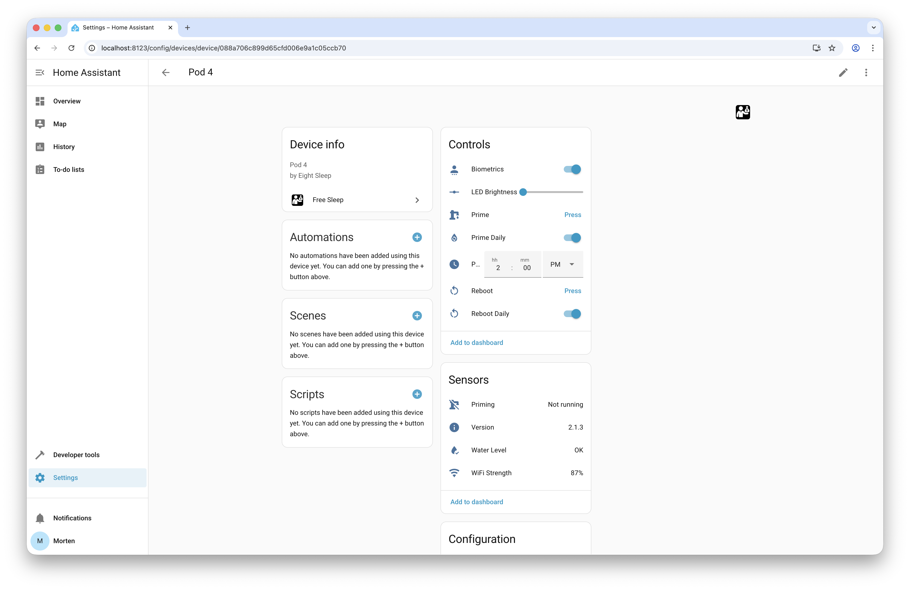
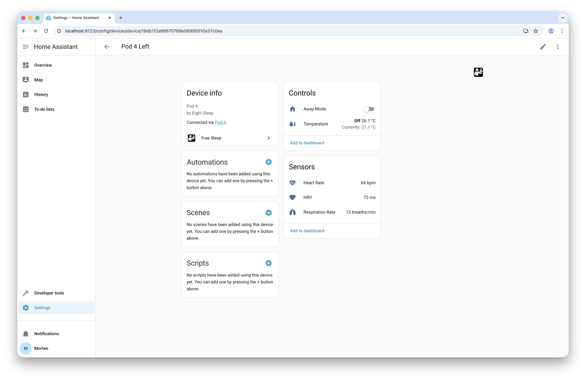

# `hass-free-sleep`

[](https://github.com/custom-components/hacs) 

An unofficial Home Assistant custom integration for [Free Sleep](https://github.com/throwaway31265/free-sleep)
devices.

> [!NOTE]
> This integration was only tested with an Eight Sleep Pod 4, and does not
> guarantee compatibility with other Eight Sleep devices. Some functionality
> like the Pod 5 base adjustments are not supported at this time.
>
> Some functionality like vitals may not be accurate.

## Table of Contents

<!-- START doctoc generated TOC please keep comment here to allow auto update -->
<!-- DON'T EDIT THIS SECTION, INSTEAD RE-RUN doctoc TO UPDATE -->

- [Overview](#overview)
- [Features](#features)
- [Installation](#installation)
  - [Installation via HACS (Recommended)](#installation-via-hacs-recommended)
  - [Manual Installation](#manual-installation)
- [Configuration](#configuration)
- [Services](#services)
  - [`free_sleep.execute`](#free_sleepexecute)
  - [`free_sleep.set_schedule`](#free_sleepset_schedule)

<!-- END doctoc generated TOC please keep comment here to allow auto update -->

## Overview

This integration allows you to control and monitor your Free Sleep device
directly from Home Assistant. You can adjust bed settings, monitor sleep data,
and view historical sleep information.

It creates three devices in Home Assistant:

- A device representing the pod itself, allowing control over the pod.
- Two devices representing each side of the bed, providing access to
  side-specific settings and data, such as temperature and sleep metrics.

[](.github/assets/main-device.png)
[](.github/assets/side-device.png)

## Features

- Control bed settings such as temperature and alarms.
- Monitor sleep data including heart rate, respiratory rate, and HRV.
- View historical sleep data through Home Assistant's UI.
- Enable or disable features like daily priming and away mode.

## Installation

### Installation via HACS (Recommended)

Installation can be done via HACS (Home Assistant Community Store). The easiest
way is to click the button below:

[](https://my.home-assistant.io/redirect/hacs_repository/?owner=Mrtenz&repository=hass-free-sleep)

Alternatively, you can follow these steps:

1. Navigate to the HACS section in Home Assistant.
2. Search for "Free Sleep" and click on it.
3. Click "Download" to install the integration.
4. Restart Home Assistant.

### Manual Installation

If you prefer to install the integration manually, follow these steps:

1. Copy the contents of the `custom_components/free_sleep` directory from the
   repository to your Home Assistant's `custom_components/free_sleep` directory.
2. Restart Home Assistant.

## Configuration

After installation, you can configure the integration through the Home Assistant
UI:

1. Navigate to "Settings" > "Devices & Services".
2. Click on "Add Integration" and search for "Free Sleep".
3. Follow the prompt to enter the hostname or IP address of your Free Sleep
   device.

## Services

The integration provides the following services that can be called from
automations or scripts:

### `free_sleep.execute`

Execute an arbitrary command on the Free Sleep device.

> [!CAUTION]
> This is a low-level service that allows you to send arbitrary commands to the
> Free Sleep device. Use with caution, as incorrect commands may lead to
> unexpected behaviour.

#### Parameters

##### `command`

The command to execute. This should be a valid command supported by the Free
Sleep API. A list of commands can be found [here](https://github.com/throwaway31265/free-sleep/blob/a040434cdd2c160a8188b4452446454bf9c81c0e/server/src/8sleep/deviceApi.ts#L6-L25).

##### `value` (optional)

The value to send with the command, if applicable.

#### Example

To set the temperature of the bed to 75 degrees (Fahrenheit), you can use the
following service call:

```yaml
service: free_sleep.execute
data:
  command: SET_TEMP
  value: 75
```

Note that the API expects temperature values in Fahrenheit.

### `free_sleep.set_schedule`

Set the sleep schedule for a specific side of the bed, or both sides. This
can be used to set the time to turn on the heating or cooling of the bed, or
control alarms.

#### Parameters

##### `side`

The side(s) of the bed to set the schedule for. This expects one or multiple
device IDs representing the sides of the bed.

##### `day_of_week` (optional)

The day of the week to set the schedule for. If not provided, the schedule will
be set for all days.

##### `schedule`

An object containing the schedule details. This can be an object containing the
`temperatures`, `power`, and/or `alarm` fields, following the structure defined
in the [Free Sleep API](https://github.com/throwaway31265/free-sleep/blob/main/server/API.md#apischedules).

> [!NOTE]
> The temperatures can be specified in Celsisu, Fahrenheit, or Kelvin, depending
> on the unit system configured in Home Assistant. The integration will handle
> the conversion to Fahrenheit as required by the Free Sleep API.

#### Example

To set a schedule for both sides of the bed to turn on heating at 21:00 with a
temperature of 23°C, then change to 25°C at 22:00 and 21°C at 07:00, you can use
the following service call (assuming Celsius is the configured unit system):

```yaml
service: free_sleep.set_schedule
data:
  side:
    - device_id_side_1
    - device_id_side_2
  schedule:
    power:
      "on": "21:00"
      onTemperature: 23
    temperatures:
      - time: "22:00"
        temperature: 25
      - time: "07:00"
        temperature: 21
```

To set an alarm for one side of the bed on Mondays and Tuesdays at 07:30 AM, you
can use the following service call:

```yaml
service: free_sleep.set_schedule
data:
  side:
    - device_id_side_1
  day_of_week:
    - monday
    - tuesday
  schedule:
    alarm:
      time: "07:30"
      enabled: true
```

Refer to the [Free Sleep API](https://github.com/throwaway31265/free-sleep/blob/main/server/API.md#apischedules)
for more details on the schedule structure and available options.
